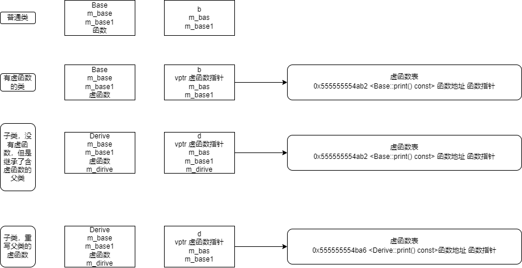

## 虚函数的实现

虚函数通过虚函数表和虚函数指针实现的，但是具体是如何利用这个表和指针进行多态调用的呢？


可以思考如下问题：

1. 虚函数指针在哪？ 干什么用的？
2. 什么是虚函数表？ 表-》信息 虚函数表-》什么信息的？ 有什么用?

3. A 类  a 对象    b c 成员  a对象内存布局是什么样？ 

## 探究虚函数表
### 没有虚函数的类

demo.cc
```cpp
#include<iostream>
using namespace std;
class Base{
    public:
            Base():m_base(0),m_base1(' '){};
            void test() const  { cout<<"Base print()"<<endl; }

    protected:
            int m_base; 
            char m_base1;   
};
int main(){
        Base b;
        return 0;
}

```
gdb调试：
```shell
(gdb) print b
$1 = {m_base = 0, m_base1 = 32 ' '}
(gdb)
```

打印实例化对象b，可以看到，对象b内存布局是由成员数据构成

### 有虚函数的类

test.cc
```cpp
#include<iostream>
using namespace std;
class Base{
public:
    Base():m_base(0),m_base1(' '){}
    virtual void print() const  { cout<<"Base print()"<<endl; }

protected:
    int m_base;	
    char m_base1;	
};
int main(){
    Base b;
    return 0;
}
```
gdb 调试：
```shell
(gdb) b 14
Breakpoint 1 at 0xa0d: file test.cc, line 14.
(gdb) run
Starting program: /home/acs/code/vtable/a.out

Breakpoint 1, main () at test.cc:14
14          return 0;
(gdb) print b
$1 = {_vptr.Base = 0x555555755d70 <vtable for Base+16>, m_base = 0, m_base1 = 32 ' '}
```
实例化的b对象开头 多了个虚函数

```shell
(gdb) info vtbl b
vtable for 'Base' @ 0x555555755d70 (subobject @ 0x7fffffffbe60):
[0]: 0x555555554ab2 <Base::print() const>
```
虚函数指针指向的地址就是虚函数表的地址

虚函数表里有保存了一个Base::print函数地址
### 有子类，但是子类不实现虚函数
test1.cc
```cpp
#include<iostream>
using namespace std;
class Base{
public:
    Base():m_base(0),m_base1(' '){}
    virtual void print() const  { cout<<"Base print()"<<endl; }
protected:
    int m_base;
    char m_base1;
};

class Derive: public Base{
private:
    int m_dirive;
};

int main(){
    Base b;
    Derive d;
    return 0;
}
```

gdb 调试：
```shell
(gdb) print b
$1 = {_vptr.Base = 0x555555755d58 <vtable for Base+16>, m_base = 0, m_base1 = 32 ' '}
(gdb) print d
$2 = {<Base> = {_vptr.Base = 0x555555755d40 <vtable for Derive+16>, m_base = 0,
    m_base1 = 32 ' '}, m_dirive = -16544}
```

```shell
(gdb) print &d.m_base
$3 = (int *) 0x7fffffffbe68
(gdb) print &d.m_base1
$4 = 0x7fffffffbe6c " U"
(gdb) print &d.m_dirive
$5 = (int *) 0x7fffffffbe70
```


### 子类重写虚函数
test2.cpp：
```cpp


```


gdb调试：
```shell
(gdb) print b
$1 = {_vptr.Base = 0x555555755d58 <vtable for Base+16>, m_base = 0, m_base1 = 32 ' '}
(gdb) print d
$2 = {<Base> = {_vptr.Base = 0x555555755d40 <vtable for Derive+16>, m_base = 0,
    m_base1 = 32 ' '}, <No data fields>}
(gdb) info vtbl b
vtable for 'Base' @ 0x555555755d58 (subobject @ 0x7fffffffbe50):
[0]: 0x555555554b6e <Base::print() const>
(gdb) info vtbl d
vtable for 'Derive' @ 0x555555755d40 (subobject @ 0x7fffffffbe60):
[0]: 0x555555554ba6 <Derive::print() const>
(gdb)
```

子类 的虚函数表指向的是 Derive::print() 


## 总结



虚函数表说白了就是里面是一组地址的数组（就是函数指针数组）

他所在的位置就是虚函数表指针里面所存储的地址，

它里面所包含的地址就是我们重写了父类的虚函数的地址（没有重写父类的虚函数那么默认的就是父类的函数地址）

