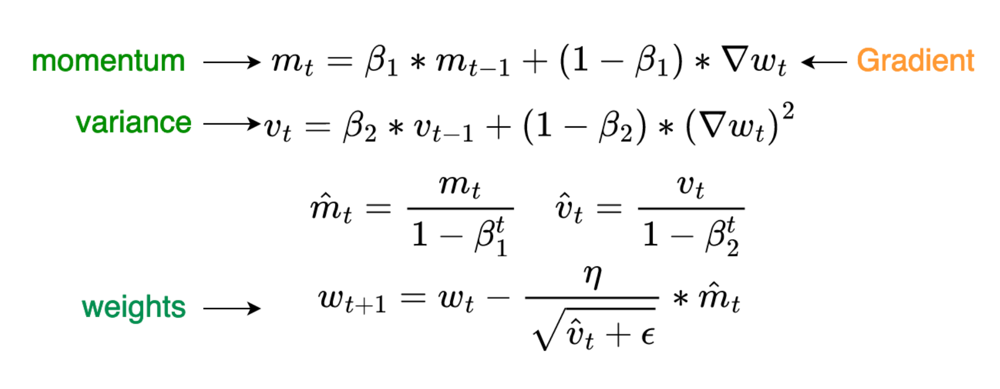
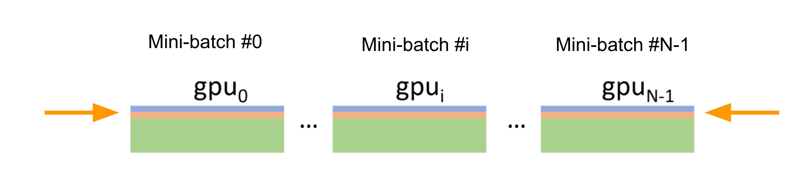
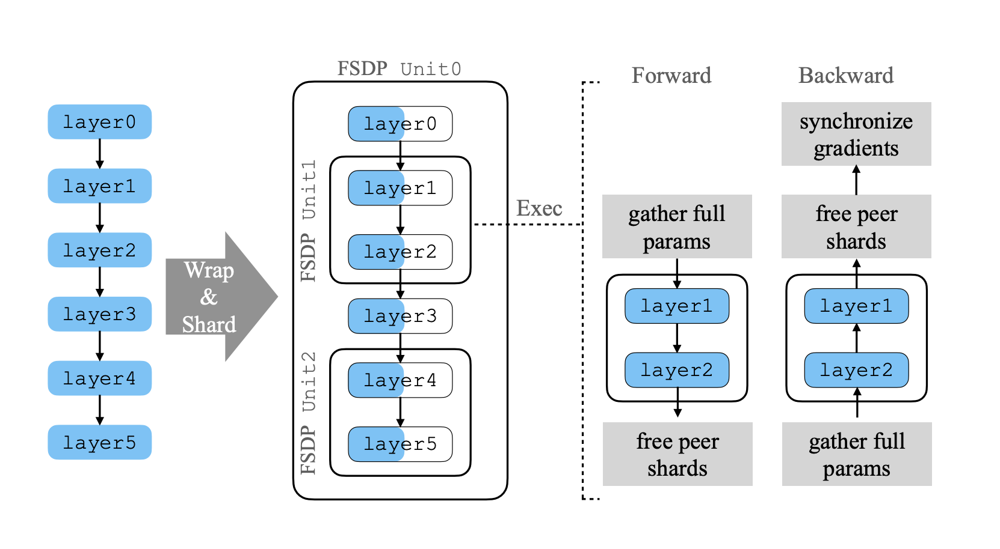
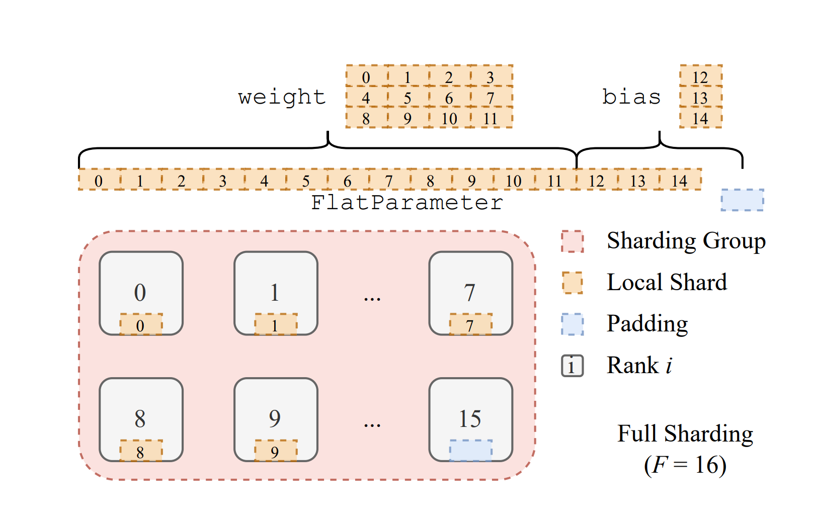
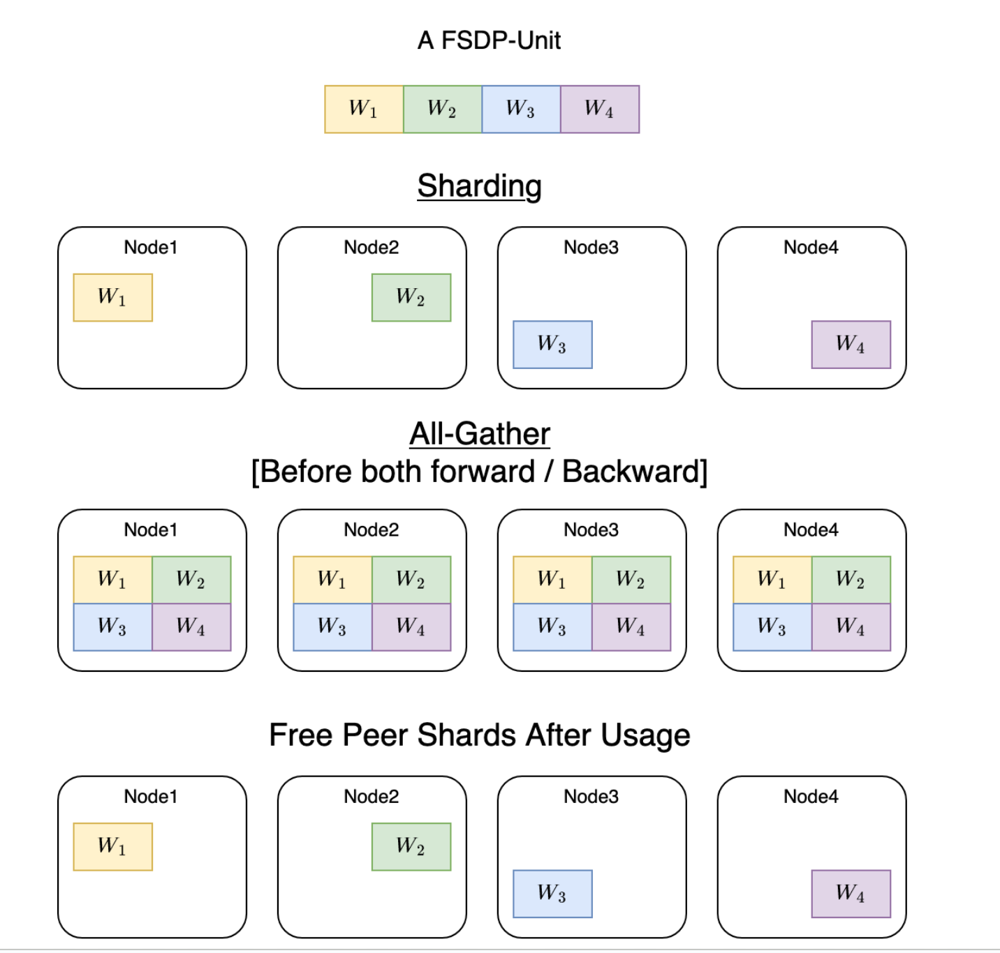
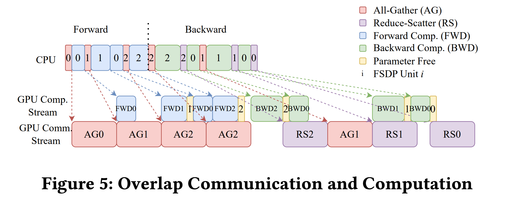
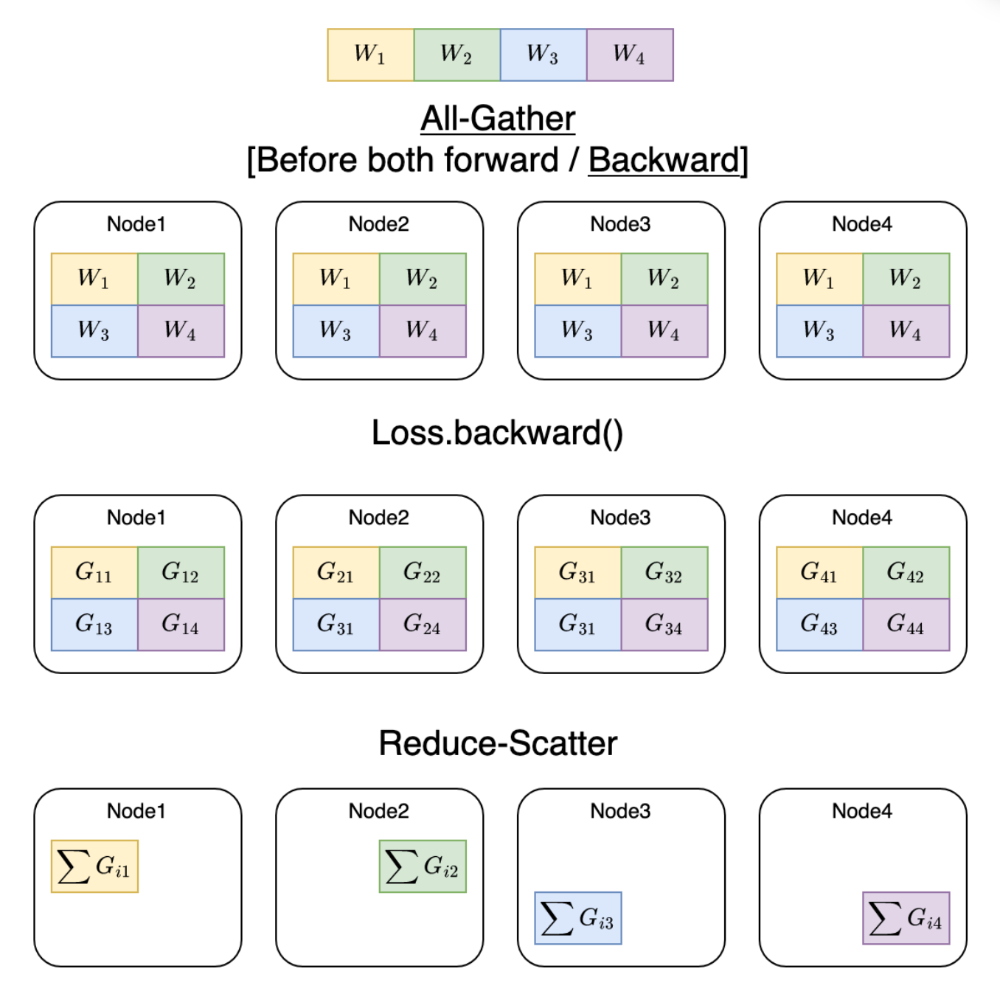
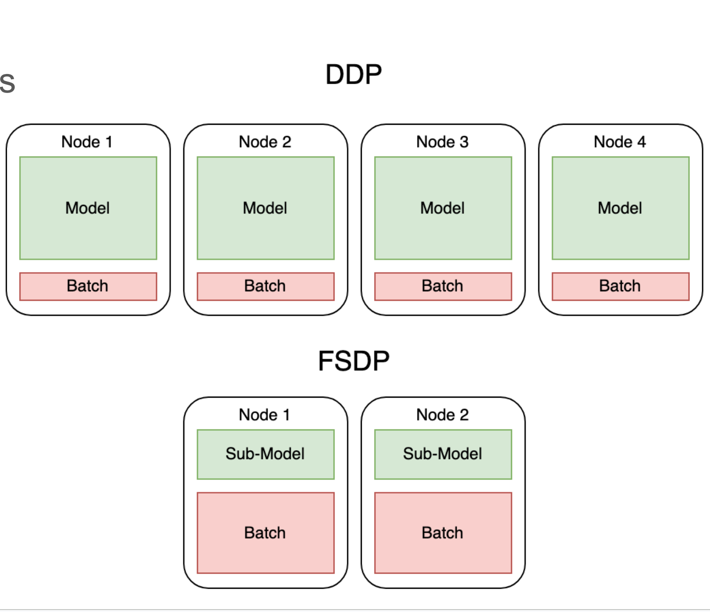

## GPU分配

P: Parameters 

G: Gradients

OS： Optimizer states


一般 1:1:6

一般都和 optimizer 有关系

- 优化器的构造会封装parameters
```py
optimizer = optim.Adam(mode.parameters(), lr=0.001)
```
- loss.backward() -> parameters.grad

- optimizer.step() -> optimizer stats 更新优化器状态
    - momentum 一阶矩阵信息， graident 的指数平均
    - variance 二阶方差信息 gradient square的指数平均 

```python
for group in optimizer.param_groups:
    for p in group['params']:
        state = optimizer.state[p]

        # Exponential moving average of gradient values
        m = state['exp_avg']  # 动量参数

        # Exponential moving average of squared gradient values
        v = state['exp_avg_sq']  # 方差参数
```


混合精度下（前向fp16 反向 更新gardients fp32）：

x 个模型参数 （FP16）

parameters: 2x 
Gradients: 2x

Optimizer stats(Adam all in fp32) 12x = 4x + 4x + 4x

 parameters copy: 4x

 momentum: 4x

 variance 4x
 


参考：https://arxiv.org/abs/1910.02054


参考这张图的BaseLine， adam 的时候K就是12 ，不同优化器可能会对应不同K


zero1 对 OS 做分区，某种意义上算是张量并行，但是只切分了OS

zero2 OS + G

zero3 OS + G + P

关于更多优化器：https://docs.pytorch.org/docs/stable/generated/torch.optim.Adam.html




NCCL 通讯库

- PCIE/NVLINk 单机多卡
- 多机多卡：IB卡


## DDP并行

数据并行，每张卡都有模型



每张卡独立前向计算
独立 反向传播，计算 gradients
All Reduce(gradients) - 广播
    把所有的 gradients 加到一起，广播到所有的GPU上
每张卡更新优化器状态和模型参数


## TP 并行，分块矩阵

## pp 并行，分层并行

```

from torch.distributed.pipeline.sync import Pipe

# Need to initialize RPC framework first.
os.environ['MASTER_ADDR'] = 'localhost'
os.environ['MASTER_PORT'] = '29500'
torch.distributed.rpc.init_rpc('worker', rank=0, world_size=1)

# Build pipe.
fc1 = nn.Linear(16, 8).cuda(0)
fc2 = nn.Linear(8, 4).cuda(1)
model = nn.Sequential(fc1, fc2)
# chunks: number of micro-batches (default: 1)
model = Pipe(model, chunks=8)

input = torch.rand(16, 16).cuda(0)
output_rref = model(input)
```

## FSDP


论文： https://arxiv.org/pdf/2304.11277


流程：

1. 定义FSDP 的unit ，具体是什么级别  vertical 切分
    layer/module/stage
2. sharding  horizontal 切分
    OS G P
3. All gather

4. Reduce Scatter


每个unit 在不同卡上做split
每个unit 做前向和反向的时候都要做一次all gather


6 个layer的 model

构造了3个unit，layer0+layer3， layer1 + layer2， layer4 + layer5

共享参数的layer 应该是要放在同一个unit


split 了

 
蓝色代表 shard

以 unit1 的执行为例子，

前向：

先gather，因为layer1 layer2 不同的参数是分在不同的GPU上，算完之后再free

反向：

先gather，再free，再广播 gradients


- construct units 构造 units
    - unit0
    - unit1
    - unit2 
  
- sharding：
    - 把unit 存成 FlatParameter
    - split FlatParameter 到多个node/gpu
    - torch.distributed.fsdp.FullyShardedDataParallel 
        - sharding_strategy
            - FULL_SHARD: os + g + p
            - shard_grad_OP: os + G


 

上图描述了sharding过程，

首先把 weight 和bias 都存成FlatParameter，可能会存在一定的padding


FlatParameter 存好之后，每张卡分到一份FlatParameter


### ALL gather


上图描述了NCCL 的all gather 原语，每张卡存了不同的shard，主要是先concat ，再做广播




上图是fsdp ，分成了4份

前向的时候gather起来，再广播

算晚forward backward再释放

每张卡继续保留部分



其中，这种前向反向的过程，是有一定的overlap处理的

首先，对unit0 gather， gather后算前向，算unit0前向的同时，可以对 unit1 做 gather，通信和计算可以同时进行，就是overlap
 

 ### reduce-scatter 


reduce 默认操作是加和，




上图，gather完之后，算完不同的梯度，4卡的梯度加起来，不同的部分再分发到不同的卡上


## DDP 和FSDP的区别

DDP 每个GPU上都有完整的模型，FSDP 每个GPU上模型不完整，留给batch的空间较大




https://huggingface.co/docs/accelerate/concept_guides/fsdp1_vs_fsdp2

https://docs.pytorch.org/tutorials/intermediate/FSDP_tutorial.html


## torch api

```python
import torch
from torch.distributed._fsdp import FullyShardedDataParallel as FSDP

torch.cuda.set_device(device_id)

sharded_module = FSDP(my_module)
optim = torch.optim.Adam(sharded_module.parameters(), lr=0.0001)
sharded_module(input).sum().backward()
optim.step()
```

## accelerate deepspeed torchrun 关系

accelerate 是huggingface 提供的高级api

可以选择使用 deepspeed/fsdp/megatron


##  QA？


fsdp 并行，虽然拆分了optimer stats 到不同的node/gpu 但是gather的时候还是要聚合的，峰值上每张卡还是会有 整个模型的parameters，Gradients 和 Optimizer stats吗


。在计算某一层时，该层的完整参数会被gather到所有参与的GPU上，所以瞬时峰值时每张卡确实会有该层的完整参数。但关键是这是逐层进行的，不是整个模型的所有参数同时存在。


https://docs.google.com/presentation/d/1ntPSYg-Wphl8sErwjUl0AztOY1i4SZmQuvmGhkeRElA/edit?slide=id.p#slide=id.p