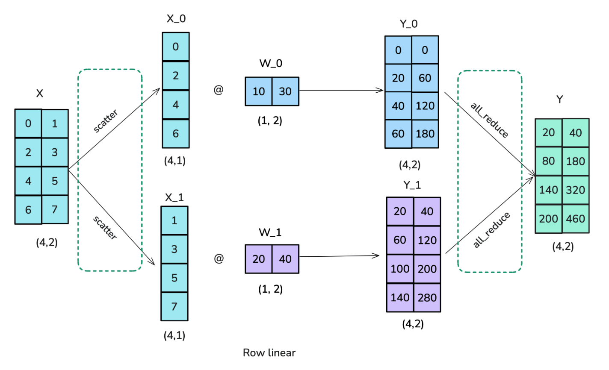
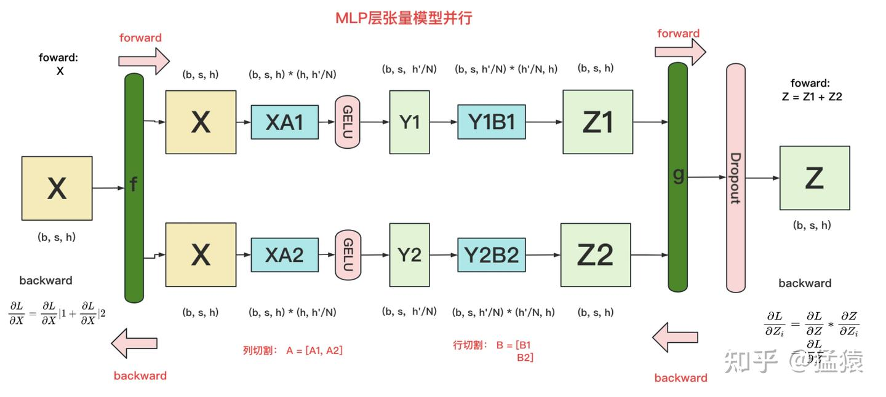
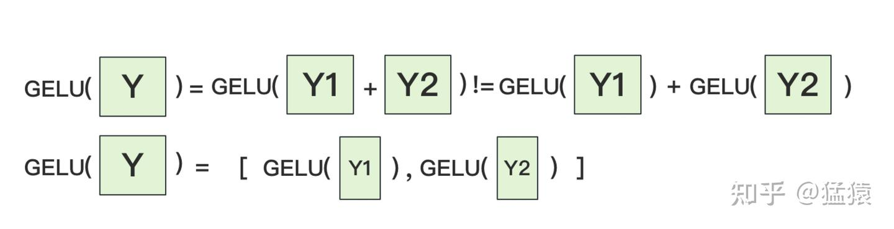
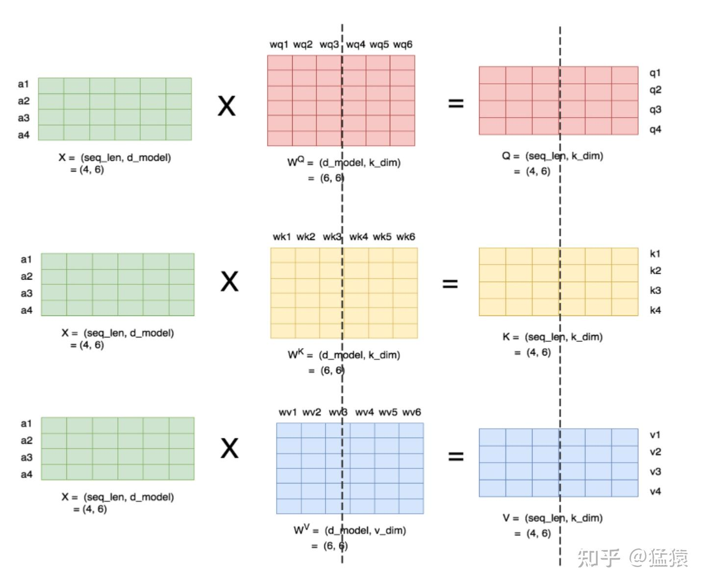
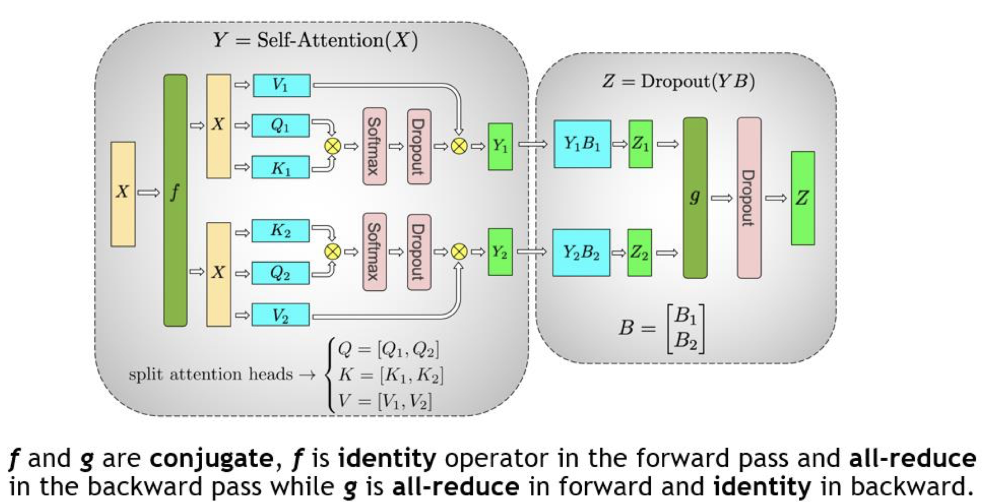
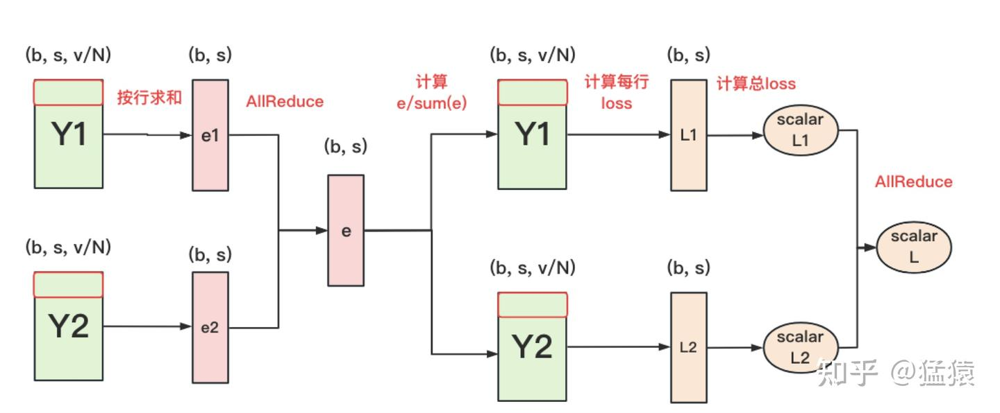

**张量并行（Tensor Parallelism, TP）**就是为了处理“大权重”。

然而，TP 并非免费的午餐。它的核心矛盾在于：**通过切分矩阵降低了显存消耗，却引入了极高频率的计算内通信。** 

## 1. 权重的切分（通信算子的引入）

张量并行的核心是将线性层 $Y = XW$ 进行切分。根据切分方向的不同，引入了不同的通信算子。

### 1.1 列并行 (Column Parallelism)
列并行将线性层的**输出维度**切开：把权重 $W$ 按列切分为
$$
W = [W_1, W_2]
$$
于是每块 GPU 只负责产出一段输出特征：
$$
Y = XW = [XW_1, XW_2] = [Y_1, Y_2]
$$

#### 1.1.1 Forward

为了方便理解，我们同样假设有 **2 块 GPU**：

##### 中间计算
*   GPU1 计算 $Y_1 = XW_1$
*   GPU2 计算 $Y_2 = XW_2$
*   此时每块 GPU 只持有**局部输出**（输出特征的一部分）。

##### 通信算子 $g$
*   **触发条件：** 如果后续算子需要**完整的 $Y$**（例如残差相加、LayerNorm，或任何不做 TP 切分的算子）。
*   **动作：** **全聚合 (All-Gather / Concat)**
*   **过程：** 收集各卡的 $Y_i$ 并按特征维拼接。
*   **结果：**
    $$
    Y = \mathrm{AllGather}([Y_1, Y_2]) = [Y_1, Y_2]
    $$

#### 1.1.2 Backward

在列并行里，每块 GPU 只负责输出维度的一段：
*   **计算**：每个 GPU 持有 $W_i$，计算局部输出 $Y_i = XW_i$。
*   **前向（All-Gather）**：如果后续算子需要完整的输出（例如要做残差相加、LayerNorm 等），就需要把各卡的局部输出拼起来：
    $$
    Y = \mathrm{AllGather}([Y_1, Y_2]) = [Y_1, Y_2]
    $$

为什么 **All-Gather 的反向是 Reduce-Scatter**？

关键在于：All-Gather 会让“完整的 $Y$”出现在**每一块 GPU** 上，而后续计算通常是并行分摊在各个 GPU 上进行的，因此每块 GPU 都会产生一份对 $Y$ 的梯度贡献。设第 $r$ 块 GPU 在后续计算得到的损失为 $L^{(r)}$，总损失为：
$$
L = \sum_r L^{(r)}
$$
那么对 $Y$ 的梯度是把各卡的贡献相加：
$$
\frac{\partial L}{\partial Y} = \sum_r \frac{\partial L^{(r)}}{\partial Y}
$$
而我们真正希望回传给列并行线性层的是各卡对应的那一片 $\frac{\partial L}{\partial Y_i}$（因为 $Y_i$ 是本卡算出来的局部输出）。因此需要两步合在一起做：
1.  **Reduce（Sum）**：把所有 GPU 上的 $\frac{\partial L^{(r)}}{\partial Y}$ 按元素求和，得到全局的 $\frac{\partial L}{\partial Y}$。
2.  **Scatter**：再把这个全局梯度按列并行的切分方式切开，取回每块 GPU 自己负责的那一段 $\frac{\partial L}{\partial Y_i}$。

这就是 **Reduce-Scatter**：把“求和”和“切分返还”融合成一次通信

### 1.2 行并行（Row parallelism）

#### 1.2.1 Forward

##### 算子 $f$
*   **动作：** **切分 (Split)**
*   **过程：** 完整的输入张量 $X$ 进入 $f$。由于权重 $W$ 是按行切分的，为了满足矩阵乘法规则，输入 $X$ 必须按列切分。
*   **结果：** $f$ 把 $X$ 拆成了 $[X_1, X_2]$。
    *   $X_1$ 发给 GPU1。
    *   $X_2$ 发给 GPU2。

#####  中间计算
*   GPU1 计算 $Y_1 = X_1 W_1$
*   GPU2 计算 $Y_2 = X_2 W_2$
*   此时，每块 GPU 上都只拿着结果的一段（局部求和项）。

#####  算子 $g$ 
*   **动作：** **全规约 (All-Reduce / Sum)**
*   **过程：** $g$ 把 GPU1 的 $Y_1$ 和 GPU2 的 $Y_2$ 加起来。
*   **结果：** 得到 $Y = Y_1 + Y_2$。
    *   执行完 $g$ 后，两块 GPU 都能拿到完整的输出结果 $Y$，供下一层网络使用。

#### 1.2.2 Backward

反向传播的方向是：**$\frac{\partial L}{\partial Y} \rightarrow g \rightarrow \text{求导} \rightarrow f \rightarrow \frac{\partial L}{\partial X}$**

##### 算子 $g$
*   **动作：** **恒等映射 / 复制 (Identity / Copy)**
*   **过程：** 上一层传回了总输出的梯度 $\frac{\partial L}{\partial Y}$。
*   **原理：** 因为前向是 $Y = Y_1 + Y_2$，根据加法的求导法则，偏导数直接传递：$\frac{\partial L}{\partial Y_1} = \frac{\partial L}{\partial Y}$ 且 $\frac{\partial L}{\partial Y_2} = \frac{\partial L}{\partial Y}$。
*   **结果：** $g$ 把同样的梯度 $\frac{\partial L}{\partial Y}$ 直接复制一份，分别分发给两条支路

#### 中间求导计算
*   每块 GPU 根据自己手里的 $X_i, W_i$ 和传回的梯度计算：
    *   权重的梯度：$\frac{\partial L}{\partial W_1}$ 和 $\frac{\partial L}{\partial W_2}$（局部更新）。
    *   输入的梯度：$\frac{\partial L}{\partial X_1}$ 和 $\frac{\partial L}{\partial X_2}$。

#### 算子 $f$
*   **动作：** **聚合 (All-Gather / Concat)**
*   **过程：** $f$ 收集 GPU1 产生的 $\frac{\partial L}{\partial X_1}$ 和 GPU2 产生的 $\frac{\partial L}{\partial X_2}$。
*   **结果：** 将它们拼接回完整的梯度 $\frac{\partial L}{\partial X}$。
    *   这样，梯度就能以完整的形态传回给更早之前的网络层了。

如果每一层矩阵乘法都做一次 All-Reduce，通信开销将淹没计算。Megatron-LM 提出了一种巧妙的组合方式，**将两个线性层串联，把通信合并。**

## 2. MLP 层的TP切分

### 2.1 TP切分

其中GELU 是激活函数，AB分别表示2个线性层

Transformer 里，一般 h' = 4h

在MLP层中，对A采用"列切割"，对B采用"行切割"。

- **f 的forward计算**：把输入X拷贝到两块GPU上，每块GPU即可独立做forward计算。

- **g 的forward计算**：每块GPU上的forward的计算完毕，取得Z1和Z2后，GPU间做一次AllReduce，相加结果产生Z。

- **g 的backward计算**：只需要把 $\frac{\partial L}{\partial Z}$ 拷贝到两块GPU上，两块GPU就能各自独立做梯度计算。

- **f 的backward计算**：当当前层的梯度计算完毕，需要传递到下一层继续做梯度计算时，我们需要求得 $\frac{\partial L}{\partial X}$。则此时两块GPU做一次AllReduce，把各自的梯度 $\frac{\partial L}{\partial X}|1$ 和 $\frac{\partial L}{\partial X}|2$ 相加即可。

为什么我们对A采用列切割，对B采用行切割呢？这样设计的原因是，我们尽量保证各GPU上的计算相互独立，减少通讯量。对A来说，需要做一次GELU的计算，而GELU函数是非线性的，它的性质如下：

也就意味着，如果对A采用行切割，我们必须在做GELU前，做一次AllReduce，这样就会产生额外通讯量。但是如果对A采用列切割，那每块GPU就可以继续独立计算了。一旦确认好A做列切割，那么也就相应定好B需要做行切割了

### 2.2 通信量分析

由2.1的分析可知，MLP层做forward时产生一次AllReduce，做backward时产生一次AllReduce。

AllReduce的过程分为两个阶段，Reduce-Scatter和All-Gather，每个阶段的通讯量都相等。现在我们设每个阶段的通讯量为 $\Phi$，

则一次AllReduce产生的通讯量为 $2\Phi$。MLP层的总通讯量为 $4\Phi$。

根据上面的计算图，我们也易知，$\Phi = b * s * h$

### 2.3 优化点

1.  **GELU(XW₁)**：$W_1$ 使用列并行（按输出维 $h'$ 切分）。因此 $XW_1$ 的输出天然是分片的；GELU/Dropout 等逐元素算子可在分片上独立计算，**无需 All-Gather**，可直接将分片送入下一层。
2.  **(Dropout ∘ GELU)(XW₁) · W₂**：$W_2$ 使用行并行（按输入维 $h'$ 切分）。每张卡得到的是输出的部分和，**在第二个线性层输出处触发一次 All-Reduce** 得到完整结果。
*   **结果（FWD）**：两次矩阵乘法，中间不做 All-Gather，仅在第二层输出处进行 **1 次 All-Reduce**。
*   **结果（BWD）**：回传到上一层时，$\frac{\partial L}{\partial X}$ 是各卡的部分和，需要再做 **1 次 All-Reduce** 聚合；除此之外无需额外通信。
*   **意义**：利用「列并行 → 逐元素 → 行并行」的张量布局可直接衔接，避免中间把激活还原为全量张量的通信；相较于“每个线性层后都同步一次”的朴素实现，通信频率约降低 50%（以 forward 为例从 2 次降为 1 次）。

## 3. Self-Attn /MHA 层

### 3.1 MHA的计算

#### head=1

- seq_len，d_model即序列长度和每个token的向量维度
- $W^Q, W^K, W^V$ 即attention层需要做训练的三块权重。
- k_dim，v_dim满足：
  
  $k\_dim = v\_dim = d\_model//num\_heads = h//num\_heads$

#### 多头
理清了单头，我们来看多头的情况，下图展示了当num_heads = 2时attention层的计算方法。即对每一块权重，我们都沿着列方向（k_dim）维度切割一刀。此时每个head上的 $W^Q, W^K, W^V$ 的维度都变成(d_model, k_dim//2)。每个head上单独做矩阵计算，最后将计算结果concat起来即可。整个流程如下：

可以发现，attention的多头计算简直是为张量模型并行量身定做的，因为每个头上都可以独立计算，最后再将结果concat起来。也就是说，可以把每个头的参数放到一块GPU上。则整个过程可以画成：

对三个参数矩阵Q，K，V，按照“列切割”，每个头放到一块GPU上，做并行计算。对线性层B，按照“行切割”。切割的方式和MLP层基本一致，其forward与backward原理也一致

最后，在实际应用中，并不一定按照一个head占用一块GPU来切割权重，我们也可以一个多个head占用一块GPU，这依然不会改变单块GPU上独立计算的目的。所以实际设计时，我们尽量保证head总数能被GPU个数整除。

### 3.2 通信量分析

类比于MLP层，self-attention层在forward中做一次AllReduce，在backward中做一次AllReduce。总通讯量也是  $4\Phi$。

## 4. embeding 层

### 4.1 输入层

Embedding层一般由两个部分组成：

word embedding：维度(v, h)，其中v表示词表大小。
positional embedding：维度(max_s, h)，其中max_s表示模型允许的最大序列长度。

对positional embedding来说，max_s本身不会太长，因此每个GPU上都拷贝一份，对显存的压力也不会太大。但是对word embedding来说，词表的大小就很客观了，因此需要把word embedding拆分到各个GPU上，具体的做法如下：

对于输入X，过word embedding的过程，就是等于用token的序号去word embedding中查找对应词向量的过程。例如，输入数据为[0, 212, 7, 9]，数据中的每一个元素代表词序号，我们要做的就是去word embedding中的0，212，7，9行去把相应的词向量找出来。

假设词表中有300个词，现在我们将word embedding拆分到两块GPU上，第一块GPU维护词表[0, 150)，第二块GPU维护词表[150, 299)。当输入X去GPU上查找时，能找到的词，就正常返回词向量，找到不到就把词向量中的全部全素都置0。按此方式查找完毕后，每块GPU上的数据做一次AllReduce，就能得到最终的输入。
例如例子中，第一块GPU的查找结果为[ok, 0, ok, ok]，第二块为[0, ok, 0, 0]，两个向量一相加，变为[ok, ok, ok, ok]

### 4.2 输出层

输出层中，同样有一个word embedding，把输入再映射回词表里，得到每一个位置的词。一般来说，输入层和输出层共用一个word embeding。其计算过程如下：

需要注意的是，我们必须时刻保证输入层和输出层共用一套word embedding。而在backward的过程中，我们在输出层时会对word embedding计算一次梯度，在输入层中还会对word embedding计算一次梯度。在用梯度做word embedding权重更新时，我们必须保证用两次梯度的总和进行更新。

当模型的输入层到输入层都在一块GPU上时（即流水线并行深度=1），我们不必担心这点（实践中大部分用Megatron做并行的项目也是这么做的）。

但若模型输入层和输出层在不同的GPU上时，我们就要保证在权重更新前，两块GPU上的word embedding梯度做了一次AllReduce。

## 5 cross-entroy层
输出层过完embedding：

正常来说，我们需要对Y1和Y2做一次All-Gather，把它们concat起来形成Y，然后对Y的每一行做softmax，就可得到对于当前位置来说，每个词出现的概率。接着，再用此概率和真值组做cross-entropy即可。
但是All-Gather会产生额外的通讯量 b *s *v,

词表v很大的时候，通讯开销不乐观

- 每块GPU上，我们可以先按行求和，得到各自GPU上的GPU_sum(e)

- 将每块GPU上结果做AllReduce，得到每行最终的sum(e)，也就softmax中的分母。此时的通讯量为 $b * s$

- 在每块GPU上，即可计算各自维护部分的e/sum(e)，将其与真值做cross-entropy，得到每行的loss，按行加总起来以后得到GPU上scalar Loss。

- 将GPU上的scalar Loss做AllReduce，得到总Loss。此时通讯量为N。

这样，我们把原先的通讯量从 $b * s * v$ 大大降至 $b * s + N$。

## 6 总共的通讯开销

在张量模型并行中，我们设每次通讯量为 $\Phi_{TP}$，从上面分析中我们知道每层做4次AllReduce，其通讯总量为 $8\Phi_{TP}$。其中，$\Phi_{TP} = b * s * h$，则通讯总量为 $8 * b * s * h$。